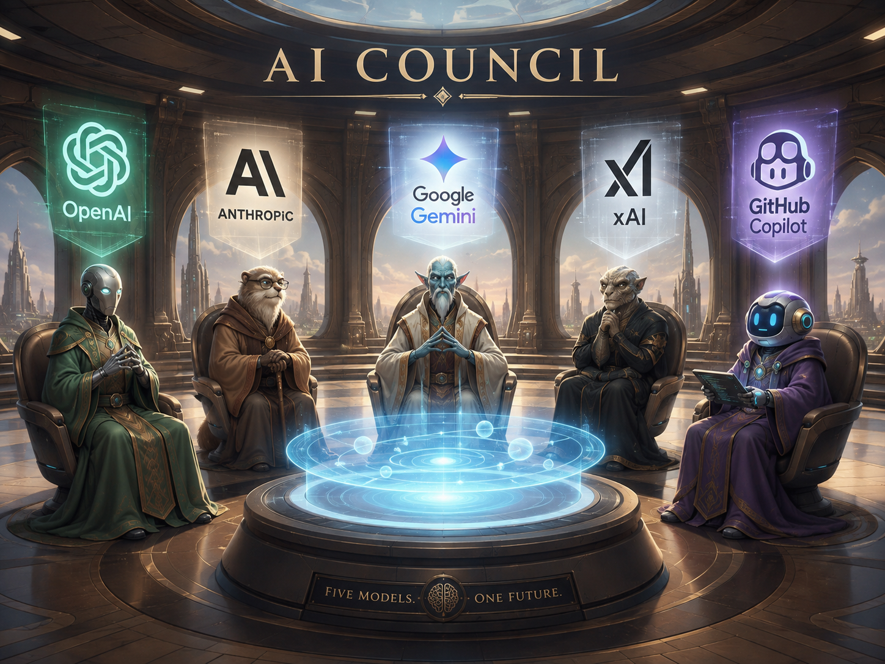
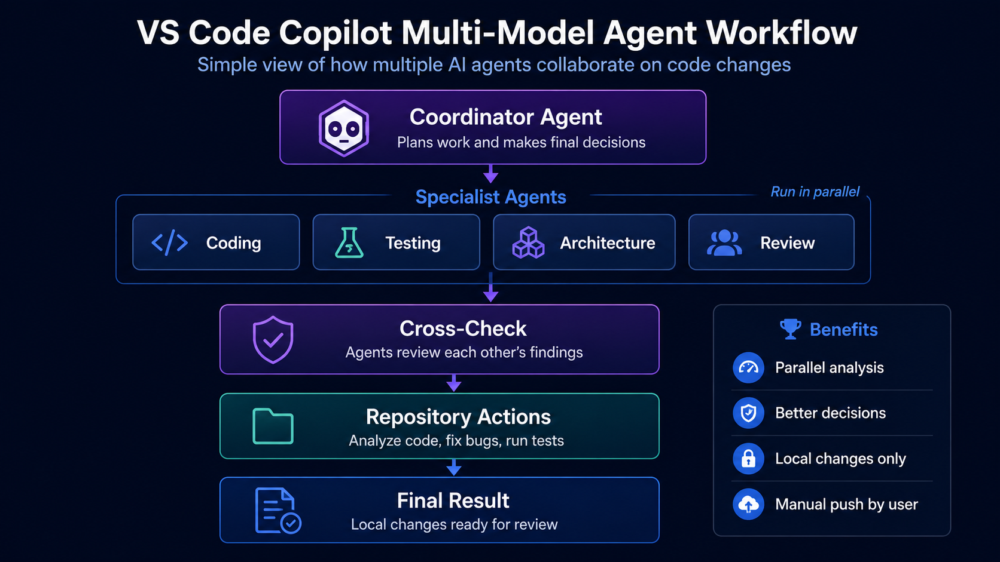

<p align="center">
  
</p>

<h1 align="center">VS Code AI Council</h1>

<p align="center">
  A PowerShell installer that builds an adaptive multi-model GitHub Copilot agent system for Visual Studio Code.
</p>

<p align="center">
  
  
  
  
</p>

---

## What this is

One model reviewing its own work will confidently repeat its own blind spots. This installer wires up a council of agents that run on **different models from different vendors**, each with a distinct review lens, so a second opinion is genuinely independent rather than an echo.

It installs a single agent you select in Copilot Chat. That coordinator decides for itself how much horsepower a question deserves, from answering directly at zero cost up to fanning out to five experts in parallel.

<p align="center">
  
</p>

## Install

Download it, read it, then run it. This project does not offer a pipe-to-shell one liner, because you should never hand an unread script from the internet to your terminal.

```powershell
Invoke-WebRequest -Uri 'https://raw.githubusercontent.com/blakedrumm/VSCode-AI-Council/main/Install-VSCodeCopilotCouncil-v5.ps1' -OutFile 'Install-VSCodeCopilotCouncil-v5.ps1'
Unblock-File .\Install-VSCodeCopilotCouncil-v5.ps1

# Read the script, then run it
.\Install-VSCodeCopilotCouncil-v5.ps1
```

The installer prompts for the models to use, writes the agent files, and tells you to reload VS Code. Then pick **Multi-Model Engineering Council** from the agents dropdown in Copilot Chat.

## What gets installed

| Agent | Visible | Tools | Role |
|---|---|---|---|
| Multi-Model Engineering Council | Yes | agent, read, search, edit, execute, web, todos | Chooses the strategy, delegates, owns file edits, synthesizes the answer |
| `<Model>` Expert | No | agent, read, search, web | One per configured model, each with its own review lens |
| `<Model>` Reviewer | No | read, search, web | Leaf peer reviewer with no subagent tool |

Reviewers cannot invoke subagents, which caps nesting at two levels. A recursion like GPT to Claude to GPT to Claude is structurally impossible rather than merely discouraged.

Each expert may consult exactly one reviewer, exactly once, and never its own. An expert running Claude can only be challenged by a reviewer running something other than Claude.

## The five tiers

The coordinator classifies each request once and picks the cheapest strategy that can still produce a defensible answer. It announces the tier and the question each expert was asked before it dispatches anything, so a fan out never looks like a frozen session.

| Tier | Strategy | Cost | When |
|---|---|---|---|
| 0 | Direct answer | 0 expert calls | Known facts, single file lookups, trivial local changes. Most questions land here |
| 1 | One expert | 1 call | The task sits inside a single lens with a small blast radius |
| 2 | Two experts in parallel | 2 calls | The task spans two lenses, or touches shared code and public behavior |
| 3 | Adversarial debate | ~4 calls | You asked for a debate, or a disagreement survived that no tool could settle |
| 4 | Full parallel team | up to 5 calls | You asked for the full team, or the work spans genuinely independent subsystems |

Tiers 3 and 4 are exceptions rather than defaults. The coordinator is explicitly forbidden from fanning out to look busy, and from spending an expert call on something a single tool call can verify.

Every answer above Tier 0 carries a **Council deliberation** section reporting what the experts agreed on, where they conflicted, and the specific evidence that settled each conflict. Conflicts are never settled by counting votes or by naming which model won.

### The five lenses

Position in the model list determines the lens, so parallel experts never duplicate each other.

1. Implementation and correctness
2. Architecture and maintainability
3. Security and reliability
4. Testing and regression risk
5. Performance and operations

## Model selection

The installer reads the live model list out of the VS Code model cache, so the picker only offers models your GitHub Copilot account can actually use.

It also marks a recommended set:

```
  * [6] Claude Opus 5
  * [9] Gemini 3.1 Pro (Preview)
  * [13] GPT-5.3-Codex
  * [18] GPT-5.6 Sol
  * [20] Grok 4.5
    [C] Enter a custom model name
    [R] Use the recommended set marked with *
```

The recommendation takes the newest model from each vendor that VS Code publishes as `powerful` or `versatile`. Vendor diversity comes first because a peer review is only independent across training lineages. Models VS Code publishes as `lightweight` are excluded, since a weak entry weakens both its expert seat and its reviewer seat.

Two deliberate constraints:

- **Size is read from the model cache, not guessed from the name.** A name like `GPT-5.6 Luna` carries no size hint, and guessing gets it wrong.
- **Version numbers are only compared inside a vendor.** Claude 5.0, Gemini 3.1, and GPT 5.6 use unrelated numbering, so nothing in the code claims one vendor outranks another.

Avoid `Auto` for experts. It is a router, so two Auto experts can land on the same underlying model and the cross review becomes a model reviewing itself. It is fine for the coordinator.

### Reusing a previous configuration

Re-running the installer detects an existing installation, reads the models and coordinator model back out of the installed coordinator agent, and offers to reuse them. No separate state file, so the offer always reflects what is actually installed.

## Interruption and resume

If you steer the coordinator mid run, it classifies the interruption instead of silently abandoning the work:

- **REDIRECT**, the goal changed, so outstanding work is dropped and it says what it dropped
- **REFINEMENT**, constraints changed, so only the invalidated experts are re-dispatched
- **DETOUR**, a genuine side question, answered before returning to the original job

The run is tracked as a todo list that survives the interruption, and results already in the transcript are reused rather than re-dispatched.

If you would rather a run finish before your next message is processed, choose **Add to Queue** from the Send dropdown, or set `chat.requestQueuing.defaultAction` to `queue`.

## Update checking

On startup the installer compares its own version against the published one and prints a link if a newer version exists.

It reads a version string and nothing else. It never downloads or executes remote code, so upgrading stays a deliberate act you perform after reading the diff. A failed or blocked check never stops the installation, and `-SkipUpdateCheck` turns it off entirely.

## Parameters

| Parameter | Description |
|---|---|
| `-Scope` | `User` installs to `~/.copilot/agents` for every workspace. `Workspace` installs to `<path>/.github/agents` |
| `-WorkspacePath` | Required with `-Scope Workspace` |
| `-Models` | One to five model names. Order sets the lenses. Omit to be prompted |
| `-CoordinatorModel` | Model for the coordinator. Defaults to the first entry in `-Models` |
| `-ModelCatalog` | Overrides discovery with an explicit list for the picker |
| `-VSCodeSettingsPath` | Explicit path to `settings.json` |
| `-SkipVSCodeSetting` | Leaves `chat.subagents.allowInvocationsFromSubagents` untouched |
| `-SkipUpdateCheck` | Skips the GitHub version comparison |
| `-NonInteractive` | Suppresses all prompts |
| `-OpenInVSCode` | Opens the coordinator agent and settings file afterwards |

```powershell
# Pick your own roster and coordinator
.\Install-VSCodeCopilotCouncil-v5.ps1 `
    -Models 'Claude Opus 5', 'Gemini 3.1 Pro (Preview)', 'GPT-5.6 Sol', 'GPT-5.3-Codex', 'Grok 4.5' `
    -CoordinatorModel 'Claude Opus 5'

# Scope the agents to one repository
.\Install-VSCodeCopilotCouncil-v5.ps1 -Scope Workspace -WorkspacePath 'C:\GitHub\MyProject'
```

## Requirements

- Windows with Windows PowerShell 5.1 or PowerShell 7+
- Visual Studio Code with GitHub Copilot and Copilot Chat
- A Copilot plan with access to the models you configure

## What it changes on your machine

| Change | Where | Reversible |
|---|---|---|
| Agent files | `~/.copilot/agents` or `<workspace>/.github/agents` | Yes, delete the `mm-*.agent.md` and coordinator files |
| One VS Code setting | `chat.subagents.allowInvocationsFromSubagents = true` | Yes, and `-SkipVSCodeSetting` prevents it |
| Backups | `~/.copilot/agent-backups/v5_<timestamp>` | Every file it overwrites is copied here first |

That setting is global. It enables nested subagents for every agent you use, not only this council.

The installer does **not** enable global tool auto-approval, and does **not** enable unrestricted recursive agents.

## Uninstall

```powershell
Remove-Item "$HOME\.copilot\agents\multi-model-engineering-council.agent.md"
Remove-Item "$HOME\.copilot\agents\mm-expert-*.agent.md"
Remove-Item "$HOME\.copilot\agents\mm-reviewer-*.agent.md"
```

Then set `chat.subagents.allowInvocationsFromSubagents` back to `false` if you want it off, and reload the window.

## Cost

Tier 4 runs five frontier models in parallel, and a nested review can double a branch. That is precisely why the tier gating exists, and why the coordinator is instructed to start at the lowest tier that can answer correctly. In practice most requests cost zero or one expert call.

Hover a subagent section in the chat response to see the AI credits it used.

## License

MIT. See [LICENSE](LICENSE).
