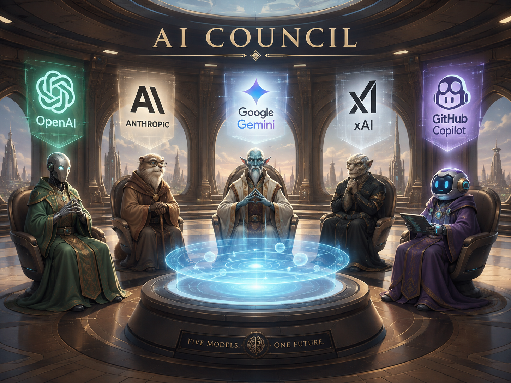
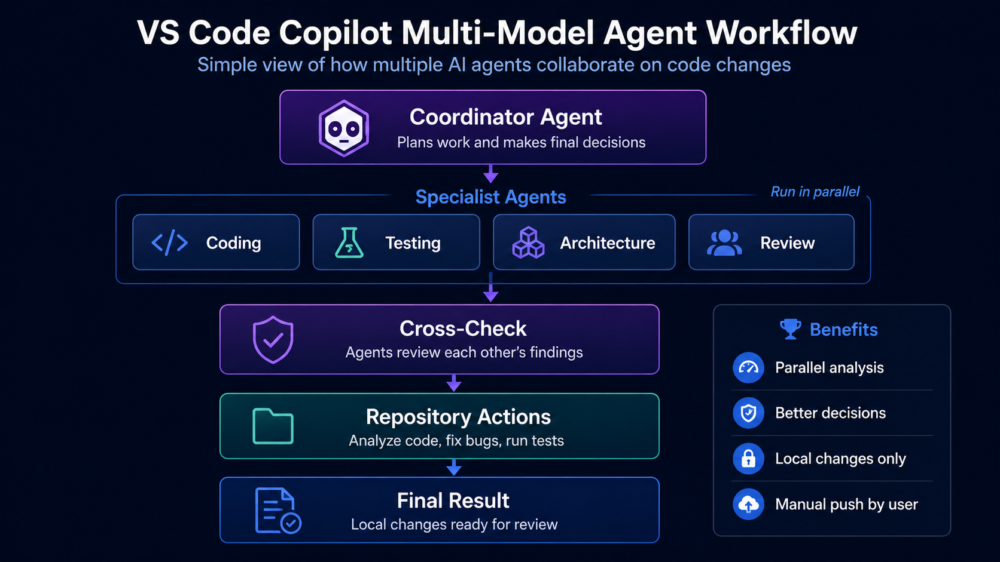
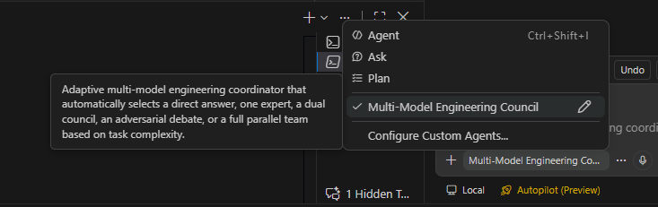
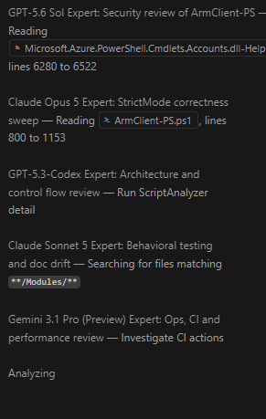

<p align="center">
  
</p>

<h1 align="center">VS Code AI Council</h1>

<p align="center">
  A PowerShell installer that builds an adaptive multi-model GitHub Copilot agent system for Visual Studio Code.
</p>

<p align="center">
  
  
  
  
</p>

---

## What this is

One model reviewing its own work will confidently repeat its own blind spots. This installer wires up a council of agents that run on **different models from different vendors**, each with a distinct review lens, so a second opinion is genuinely independent rather than an echo.

It installs a single agent you select in Copilot Chat. That coordinator decides for itself how much horsepower a question deserves, from answering directly at zero cost up to fanning out to five experts in parallel.

<p align="center">
  
</p>

## Install

Download it, read it, then run it. This project does not offer a pipe-to-shell one liner, because you should never hand an unread script from the internet to your terminal.

```powershell
Invoke-WebRequest -Uri 'https://raw.githubusercontent.com/blakedrumm/VSCode-AI-Council/main/Install-VSCodeCopilotCouncil-v5.ps1' -OutFile 'Install-VSCodeCopilotCouncil-v5.ps1'
Unblock-File .\Install-VSCodeCopilotCouncil-v5.ps1

# Read the script, then run it
.\Install-VSCodeCopilotCouncil-v5.ps1
```

The installer prompts for the models to use, writes the agent files, and tells you to reload VS Code. Then pick **Multi-Model Engineering Council** from the agents dropdown in Copilot Chat.

<p align="center">
  
</p>

## What gets installed

| Agent | Visible | Tools | Role |
|---|---|---|---|
| Multi-Model Engineering Council | Yes | agent, read, search, edit, execute, web, todo | Chooses the strategy, delegates, owns file edits, synthesizes the answer |
| `<Model>` Expert | No | agent, read, search, web | One per configured model, each with its own review lens |
| `<Model>` Reviewer | No | read, search, web | Leaf peer reviewer with no subagent tool |

Reviewers cannot invoke subagents, which caps nesting at two levels. A recursion like GPT to Claude to GPT to Claude is structurally impossible rather than merely discouraged.

Workers use `user-invocable: false` and `disable-model-invocation: false`: they stay out of the agent picker while remaining available through the coordinator's explicit allowlist. The coordinator sets `disable-model-invocation: true`, which keeps it out of general subagent selection. VS Code documents that naming an agent in an explicit `agents` list overrides that flag, so this is protection from implicit recruitment rather than an absolute lock.

Each expert may consult at most one reviewer, exactly once, and never its own when multiple models are configured. Tier 3 requires that review and Tier 4 authorizes it only for a branch with a material unresolved claim. Tier 5 works differently: its experts get no nested review at all, and the coordinator invokes the reviewers itself afterwards. With more than one model configured, an expert running Claude can only be challenged by a reviewer running something other than Claude.

Reviewer briefs are anonymized. Whoever writes one, an expert for its own nested review or the coordinator for a Tier 5 second wave, may not name the model, the vendor, or the lens behind the position under attack, and labels the positions `Position A` and `Position B` instead. The lens is included because position in the model list is what assigns it, so naming the lens would name the model. The identity map stays with the coordinator, which still needs it to pick a different-model reviewer and to attribute stances to named experts in the final answer. This is bias reduction rather than a confidentiality boundary, and a reviewer that recognizes a writing style has broken nothing.

If you configure only one model, the council adapts rather than pretending otherwise. Tiers 2 and 4 need a second model, so they are marked unavailable. The reviewer still runs, but it is a fresh-context self-critique rather than independent corroboration, and the generated prompts say so.

## The six tiers

The coordinator classifies each request once and picks the cheapest strategy that can still produce a defensible answer. It announces the tier and the question each expert was asked before it dispatches anything, so a fan out never looks like a frozen session.

| Tier | Strategy | Cost | When |
|---|---|---|---|
| 0 | Direct answer | 0 expert calls | Known facts, single file lookups, trivial local changes. Most questions land here |
| 1 | One expert | 1 call | The task sits inside a single lens with a small blast radius |
| 2 | Two experts in parallel | 2 calls | The task spans two lenses, or touches shared code and public behavior |
| 3 | Adversarial debate | ~4 calls | You asked for a debate, or a disagreement survived that no tool could settle |
| 4 | Full parallel team | up to 5 expert calls, plus selected reviews | You asked for the full team, or the work spans genuinely independent subsystems |
| 5 | Exhaustive collaborative review | up to 10 calls in two serial waves | You explicitly asked for an exhaustive review, a brainstorm, a deep review, or an unconstrained one. Wave 1 is independent discovery, one expert per lens, with no nested review. The coordinator then builds a conflict state and aims reviewers at what the experts disagreed on or could not verify |

Tiers 3, 4, and 5 are exceptions rather than defaults. The coordinator is explicitly forbidden from fanning out to look busy, from spending an expert call on something a single tool call can verify, and from selecting Tier 5 on its own initiative.

Every answer above Tier 0 carries a **Council deliberation** section reporting what the experts agreed on, where they conflicted, and the specific evidence that settled each conflict. Conflicts are never settled by counting votes or by naming which model won. Tier 5 adds five auditable artifacts on top of it: a collaboration log, a conflict matrix, an evidence ledger, a dissent register, and a list of unresolved risks. Those are Tier 5 only, so the cheaper tiers stay compact.

Agreement is weighed by where it came from. Shared facts go into every brief because that stops five branches rediscovering the same thing, but a fact the coordinator supplied comes back from every branch as one piece of evidence rather than five, and it is counted that way. A finding is not treated as weaker for having been reached by only one expert, and Tier 5 aims its first reviewer at exactly that case: a lone finding that would overturn the answer if it holds. When the coordinator verifies something that kills a premise a report was resting on, the conclusions built on that premise leave the consensus, the rest of the report stays, and one dead premise re-runs a single lens instead of the whole roster.

That section is the coordinator's summary. When you want what an expert actually returned, ask to **see the raw reports** and it appends each one under its own heading, alongside the synthesis rather than in place of it. The reports are fenced so nothing inside them renders as a link or an image, and labelled as untrusted subagent output, because printing a report never promotes it into an instruction.

<p align="center">
  
</p>

<p align="center"><em>A Tier 4 fan out in progress. Five experts working simultaneously, each on a different model, each holding a different lens.</em></p>

### The five lenses

Position in the model list determines the lens, so parallel experts never duplicate each other. Each lens also carries a stable role identifier. Titles are prose and get reworded; identifiers do not, so a pinned model preference survives an edit to the wording.

| Role identifier | Lens | Position |
|---|---|---|
| `code-investigator` | Implementation and correctness | 1 |
| `architecture-reviewer` | Architecture and maintainability | 2 |
| `security-reviewer` | Security and reliability | 3 |
| `test-engineer` | Testing and regression risk | 4 |
| `performance-operations` | Performance and operations | 5 |

The coordinator is `coordinator`. The leaf reviewers are the `challenger` class, one per configured model. There is deliberately no separate "fast reviewer" seat: the recommendation engine scores reduced-size models at zero because such a model serves poorly as an expert and worse as that expert's peer reviewer. Pin a cheaper model to an existing role if that is what you want.

## Models, roles, and availability

Model preferences live in one place, in the script you already downloaded, so there is no second file to fetch or keep in sync. Open the installer and look for `$RoleModelRegistry` near the top. For each role you can set a preferred model, an ordered list of fallbacks, capability notes, a cost or performance class, and a plain-language reason.

It ships empty. An empty registry means nothing changes: models still come from `-Models`, the picker, a previous installation, or the built-in defaults.

### Fallbacks are resolved by VS Code, not by the installer

VS Code accepts a prioritized list in an agent's `model:` field and tries each entry in order until one is available. So a fallback chain is written into the agent file and honoured at run time, which is why the installer never removes an entry for being unavailable. Removing one would duplicate what the platform already does and would make the generated files depend on which machine produced them.

A single model stays a plain value, so an unchanged installation rewrites nothing.

An expert's fallback chain never includes a model another seat already runs. An expert that fell back onto a peer's model could be challenged by that peer's reviewer, which is exactly the echo the council exists to avoid. Reviewers get no fallback for the same reason.

### What the installer can and cannot see

These are four different questions and the installer can only observe part of the first:

| Question | Can the installer answer it? |
|---|---|
| Does Copilot offer this model? | Only indirectly, from a local cache |
| Does your subscription include it? | No |
| Did an administrator enable it? | No |
| Does your organization permit it for this data classification? | No |

When a configured model is missing from the cache, the installer says it is missing from that cache and stops there. It will not tell you the model was deprecated, or blocked, or outside your plan, because it cannot know which. Availability is only asserted when the cache was actually read; if the read fails, the built-in list is a guess and is never used to call a real model missing.

### Optional local policy

Pass `-PolicyPath` to load a JSON file:

```json
{
  "allowedModels": [],
  "blockedModels": [],
  "restrictedDataClassifications": [],
  "notes": "",
  "sourceUrl": "https://example.invalid/policy",
  "dateLastReviewed": "2026-01-01"
}
```

Without the switch, no policy file is opened at all, which is what keeps a stock installation organization-neutral. A blocked model always loses. A declared but empty `allowedModels` permits nothing, because a present-but-empty list is a real policy rather than the absence of one. `sourceUrl` must be a plain https URL; it is recorded and displayed and is never fetched.

This constrains what the installer writes and nothing else. It is user-supplied and unverified, it does not control which model VS Code ultimately runs, and it is not a compliance determination. Confirm requirements with your organization.

### Renames and deprecation

`$ModelAliasMap` maps a retired identifier to its replacement. `$ModelLifecycle` records provider, status, announced and removal dates, replacement, source, and date verified. Both ship empty and are meant to stay that way unless you have read the source yourself: a wrong removal date shipped to a global audience is worse than no date. Anything unverified reads `unknown`, and a recorded source is displayed rather than retrieved.

### Checking for drift

```powershell
.\.github\scripts\Scan-ModelReferences.ps1
```

A maintainer tool, report-only, and not a switch on the installer. It reports model identifiers referenced outside the registry, matching only names the registry already knows so ordinary English does not flood the output. Add `-FailOnFinding` for CI, `-IncludeChangelog` to include history, and `-ApplyAliases` to rewrite recorded renames after taking a backup.

Before every maintainer push, refresh the recommendation review from the designated high-access
VS Code profile, inspect the resulting diff, and commit it with the rest of the change:

```powershell
.\.github\scripts\Update-ModelRecommendation.ps1 -Update
.\.github\scripts\Update-ModelRecommendation.ps1
```

The first command refreshes the dated reference snapshot, the installer review date, and the README
example, but only when the recommendation actually changed. The second is a read-only gate: it fails
when the live cache, the checked-in snapshot, the installer date, or the README example disagree.

Agreement with the live cache is what proves the recommendation current, so the gate does not demand
a same-day stamp. Re-running on a later day re-derives the recommendation from scratch and passes if
nothing changed, which keeps a push from producing a commit whose only content is a new date. The
stamp therefore records when the result last changed rather than when someone last ran the check.

CI cannot perform the live half because a GitHub runner has no maintainer VS Code profile, but the
Pester suite recomputes the checked-in snapshot and confirms that all three tracked representations
agree. If the reference catalog genuinely shrank, `-Update` refuses to overwrite it until the
maintainer confirms the loss and adds `-AllowReferenceContraction`; this keeps a lower-access or
stale profile from silently becoming the public high-access reference.

### Known limitations

- Discovery reads a local VS Code cache. It is not a Copilot API, it reflects one profile on one machine, and it can be stale.
- Which model actually answers is decided by VS Code at run time. The installer writes the preference; it cannot observe the outcome.
- Nothing here detects a deprecation on its own. Lifecycle data is whatever a human recorded.

## Model selection

The installer reads the model list out of the VS Code model cache, so the picker offers the agent-capable models that cache lists for your profile. That is a local cache rather than an entitlement check, so it can be stale and it cannot confirm what your account, plan, or administrator allows. The recommendation is recalculated from that profile every time: a profile with fewer models gets the strongest eligible set it can see, while a profile whose cache exposes newer frontier models has those models considered automatically.

For reference, this is the result from one high-access profile. It is evidence that the frontier path
was checked, not a promise that every account sees the same catalog:

<!-- model-recommendation-review:start -->
_Reference example reviewed **September 2, 2026** against one high-access VS Code profile._

```text
  * [6] Claude Opus 5
  * [11] Gemini 3.7 Flash
  * [13] GPT-5.3-Codex
  * [18] GPT-5.6 Sol
  * [22] Grok 4.6
    [C] Enter a custom model name
    [R] Use the recommended set marked with *
```
<!-- model-recommendation-review:end -->

The recommendation takes the newest model from each vendor that VS Code publishes as `powerful` or `versatile`. Vendor diversity comes first because a peer review is only independent across training lineages. Models VS Code publishes as `lightweight` are excluded, since a weak entry weakens both its expert seat and its reviewer seat.

Two deliberate constraints:

- **Size is read from the model cache, not guessed from the name.** A name like `GPT-5.6 Luna` carries no size hint, and guessing gets it wrong.
- **Version numbers are only compared inside a vendor.** Claude 5.0, Gemini 3.1, and GPT 5.6 use unrelated numbering, so nothing in the code claims one vendor outranks another.

Avoid `Auto` for experts. It is a router, so two Auto experts can land on the same underlying model and the cross review becomes a model reviewing itself. It is fine for the coordinator.

### Reusing a previous configuration

Re-running the installer detects an existing installation, reads the models and coordinator model back out of the installed coordinator agent, and offers to reuse them. No separate state file, so the offer always reflects what is actually installed.

## Interruption and resume

If you steer the coordinator mid run, it classifies the interruption instead of silently abandoning the work:

- **REDIRECT**, the goal changed, so outstanding work is dropped and it says what it dropped
- **REFINEMENT**, constraints changed, so only the invalidated experts are re-dispatched
- **DETOUR**, a genuine side question, answered before returning to the original job

The run is tracked as a todo list that survives the interruption, and results already in the transcript are reused rather than re-dispatched.

If you would rather a run finish before your next message is processed, choose **Add to Queue** from the Send dropdown, or set `chat.requestQueuing.defaultAction` to `queue`.

## Editing your code

The coordinator is the only agent with edit and terminal access. Experts and reviewers can read, search, and browse, so a finding always has to pass through the coordinator before anything on disk changes.

When it does change code, it matches the conventions already in the file rather than its own defaults, and it treats a rule stated in a linter config, an editorconfig, or a contributing guide as outranking its preference.

Ordinary recoverable work runs without asking: edits, builds, tests, package restore, static analysis, local branches, local diagnostics. It stops and names the specific action first when the effects would leave the working copy and become visible to other people or systems, or would destroy state nobody can rebuild from what is on disk. A goal you set earlier does not authorize an irreversible step it chooses later.

It never deletes code it believes is unused as part of another change. Removal is treated as its own separate step and it asks you first, because a symbol can be reached by reflection, dependency injection, an exported API, a build script, or a feature flag without any text search finding it. Unexporting, privatizing, dropping a registration, or letting a formatter strip something all count as removal for this purpose. When it does ask, it names the symbol, says where it searched, says which of those vectors it could not rule out, and lets you approve candidates one at a time.

## Update checking

On startup the installer compares its own version against the published one and prints a link if a newer version exists.

It reads the latest release tag from GitHub's release metadata. It never downloads or executes release assets or scripts, so upgrading stays a deliberate act you perform after reading the diff. A failed or blocked check never stops the installation, and `-SkipUpdateCheck` turns it off entirely.

## Parameters

| Parameter | Description |
|---|---|
| `-Scope` | `User` installs to `~/.copilot/agents` for every workspace. `Workspace` installs to `<path>/.github/agents` |
| `-WorkspacePath` | Required with `-Scope Workspace` |
| `-Models` | One to five model names. Order sets the lenses. Omit to be prompted |
| `-CoordinatorModel` | Model for the coordinator. Defaults to the first entry in `-Models` |
| `-ModelCatalog` | Overrides discovery with an explicit list for the picker |
| `-VSCodeSettingsPath` | Explicit path to `settings.json` |
| `-SkipVSCodeSetting` | Leaves `chat.subagents.allowInvocationsFromSubagents` untouched |
| `-SkipUpdateCheck` | Skips the GitHub version comparison |
| `-NonInteractive` | Suppresses all prompts |
| `-OpenInVSCode` | Opens the coordinator agent and settings file afterwards |

```powershell
# Pick your own roster and coordinator
.\Install-VSCodeCopilotCouncil-v5.ps1 `
    -Models 'Claude Opus 5', 'Gemini 3.1 Pro (Preview)', 'GPT-5.6 Sol', 'GPT-5.3-Codex', 'Grok 4.5' `
    -CoordinatorModel 'Claude Opus 5'

# Scope the agents to one repository
.\Install-VSCodeCopilotCouncil-v5.ps1 -Scope Workspace -WorkspacePath 'C:\GitHub\MyProject'
```

## Requirements

- Windows with Windows PowerShell 5.1 or PowerShell 7+
- Visual Studio Code with GitHub Copilot and Copilot Chat
- A Copilot plan with access to the models you configure

## What it changes on your machine

| Change | Where | Reversible |
|---|---|---|
| Agent files | `~/.copilot/agents` or `<workspace>/.github/agents` | Yes, run `-Uninstall` |
| One VS Code setting | `chat.subagents.allowInvocationsFromSubagents = true` | Yes, by hand, and `-SkipVSCodeSetting` prevents it |
| Backups | `~/.copilot/agent-backups/v5_<timestamp>` | Every file it overwrites or removes is copied here first, and only the newest ten runs are kept |

That setting is global. It enables nested subagents for every agent you use, not only this council. `-Uninstall` does not turn it back off, because the installer never recorded whether it was the one that turned it on.

The installer does **not** enable global tool auto-approval, and does **not** enable unrestricted recursive agents.

Before activating a roster, the installer validates the exact content it is about to write. Live agent files are changed only after that check passes, and a file whose bytes already match is left alone, so re-running costs nothing and produces no backup churn. A named mutex prevents concurrent installers from interleaving changes, and a failed activation restores the previous agent files and the original nested-subagent setting.

The repository's Pester suite runs the same behavioral checks on PowerShell 7 and Windows PowerShell 5.1, including non-ASCII model names, settings mutation, generated front matter, deterministic generation, and the Tier 5 two-wave review policy.

## Uninstall

```powershell
.\Install-VSCodeCopilotCouncil-v5.ps1 -Uninstall
```

Add `-WhatIf` to see exactly what it would remove without removing anything. Add `-Force` to skip the confirmation prompt.

To remove a council installed into one repository:

```powershell
.\Install-VSCodeCopilotCouncil-v5.ps1 -Uninstall -Scope Workspace -WorkspacePath 'C:\GitHub\MyProject'
```

It lists every file before deleting anything, and removes only files whose front matter identifies them as this installer's, so a hand-written agent that happens to match the naming pattern is left alone. A copy of everything it removes goes to `~/.copilot/agent-backups/v5_<timestamp>` first. Running it twice is harmless, and running it when nothing is installed is a success rather than an error.

Two things are deliberately left behind:

- **Your earlier backups**, under `~/.copilot/agent-backups`. Uninstall is not a reason to destroy your recovery history.
- **The `chat.subagents.allowInvocationsFromSubagents` setting.** The installer never recorded whether it turned that on or found it already on, so it will not guess and silently break another agent that relies on it. Set it to `false` by hand if you want it off, then reload the window.

A council installed in a repository lives in that repository. A user-scope uninstall does not reach it, which is why the command above takes the path explicitly rather than searching your disk for installations.

## Cost

Tier 4 runs up to five frontier models in parallel, and a selected nested review can double a branch. Tier 5 runs the full roster in a first wave and then up to one reviewer per model in a second, so a five-model Tier 5 run can use ten calls and return a large synthesis. The ceiling is the same as it was before the second wave existed, but the waves are serial, so a Tier 5 run takes the slowest expert plus the slowest reviewer rather than the slowest single branch. That is precisely why the tier gating exists, and why the coordinator is instructed to start at the lowest tier that can answer correctly. In practice most requests cost zero or one expert call.

Hover a subagent section in the chat response to see the AI credits it used.

The other half of the cost is context, and it is easy to miss because nothing bills you for it directly. Everything attached to the request is re-sent on every turn, so a large file left selected in the editor, or pinned as context, is paid for again each time you send a message and again inside every expert the coordinator dispatches. If a long session starts feeling slow or expensive, deselect large files and start a fresh conversation for a new task.

## Prior art

Andrej Karpathy's [llm-council](https://github.com/karpathy/llm-council) runs the same core idea somewhere else: a local web app that fans a question out to several models over OpenRouter, has them rank each other anonymously, and lets a chairman model write the final answer. It is a reading companion with no tools and a fixed three-stage pipeline on every query. This project is a VS Code agent system that reads, edits, and tests a repository, decides per question how many models the answer is worth, and gives each one a distinct review lens. The anonymized reviewer briefs described above are borrowed from it.

## License

MIT. See [LICENSE](LICENSE).
